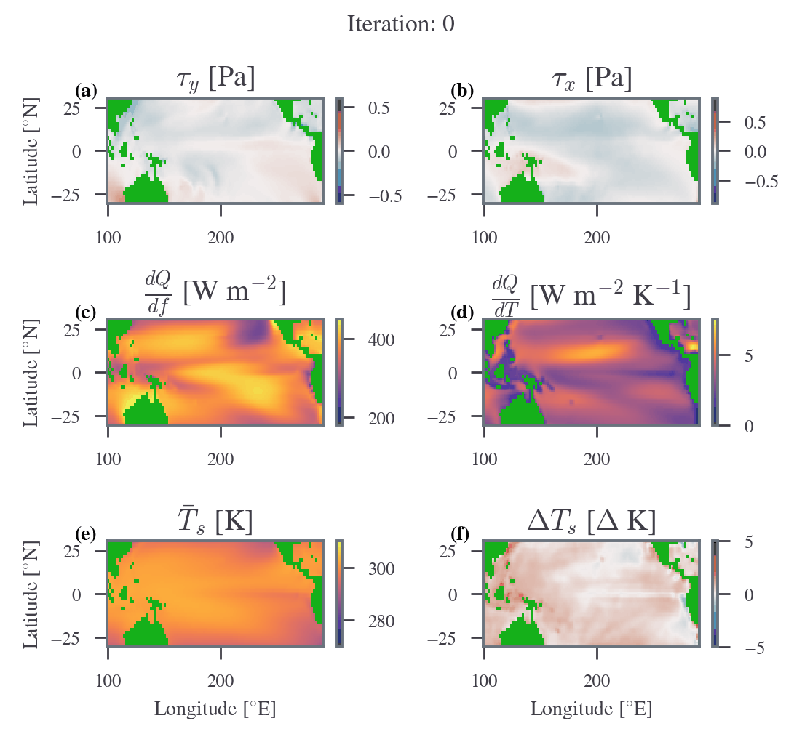

# seager19

<a href="https://opensource.org/licenses/MIT"></a>
 <a href="https://github.com/psf/black"></a>
 <a href=https://www.python.org/downloads/release/python-388/></a>
<a href='https://seager19.readthedocs.io/en/latest/?badge=latest'>

</a>
<a href='https://travis-ci.com/sdat2/seager19'>
    
</a>
<a href='https://coveralls.io/github/sdat2/seager19?branch=main'></a>
<a href=https://github.com/sdat2/seager19/actions></a>
<a href=https://github.com/sdat2/seager19/actions></a>

Model run results: <https://wandb.ai/sdat2/seager19>

Docker image for gfortran/gcc/cdf/conda: <https://hub.docker.com/repository/docker/sdat2/seager19>



## Purpose

A repository to contain, analyse, and expand upon the model from:

### Seager et al. 2019, Nature Climate Change, Strengthening Tropical Pacific Zonal Sea Surface Temperature Gradient Consistent with Rising Greenhouse Gases

<https://doi.org/10.1038/s41558-019-0505-x>

### Summary of their paper

- There is a west-east warm-to-cold contrast in the Pacific.

- GCMs predict weakening contrast with GHG conc.

- In observations it has increased.

- Their simple linear model agrees with observations.

### Citation

The citation for their paper is:

```bibtex
@article{seager2019strengthening,
  title={Strengthening tropical Pacific zonal sea surface temperature gradient consistent with rising greenhouse gases},
  author={Seager, Richard and Cane, Mark and Henderson, Naomi and Lee, Dong-Eun and Abernathey, Ryan and Zhang, Honghai},
  journal={Nature Climate Change},
  volume={9},
  number={7},
  pages={517--522},
  year={2019},
  url={https://doi.org/10.1038/s41558-019-0505-x},
  publisher={Nature Publishing Group}
}
```

### Podcast

The paper is discussed in a podcast available at Deep Convection Season 1 Episode 5:

<a href='https://deep-convection.org/2020/04/13/episode-5-richard-seager/'>

</a>

Specifically the time period 33:00-44:30.

### Code

The code and data were taken from a Columbia University website:

<a href='http://kage.ldeo.columbia.edu:81/SOURCES/.LDEO/.ClimateGroup/.PROJECTS/.PublicationsData/.Seager_etal_NCC-2019/'>

</a>

This website is blocked from some IP addresses, such as the Cambridge VPN (probably my fault),
and so you may need to try a different connection method if it doesn't load.

## Setup

### Get the github repository

```bash

    git clone https://github.com/sdat2/seager19.git

    cd seager19
```

### If you have root access and can install linux packages

```bash

    sudo apt-get install gfortran

    sudo apt-get install gcc

    sudo apt-get install --fix-missing libnetcdf-dev libnetcdff-dev

    sudo apt-get install cloc
```

### If you want to make the docker environment yourself

```bash

    docker build . -t sdat2/seager19:g4.8

    docker push sdat2/seager19:g4.8
```

### If you need to install the singularity environment

```bash

    TMPDIR=/home/users/sithom/tmp SINGULARITY_CACHEDIR=/home/users/sithom/tmp singularity pull docker://sdat2/seager19:g4.8

    singularity run seager19_g4.8.sif

```

### Making the environment and testing it works

```bash

    conda init bash

    source ~/.bash_profile

    conda activate ./env/

    make test        # Also downloads the data if needed.

```

### Add optional features

```bash

    make jupyter_pro

    make report
```

### Examples of running the model

```bash

    python src/main.py name=cd_1.7 coup.c_d=1.7e-3

    python src/main.py name=cd_2.0 coup.c_d=2.0e-3

    python src/main.py name=cd_1.0 coup.c_d=1.0e-3
```

### Moving old model runs

```bash

    mv -f logs/* /gws/nopw/j04/ai4er/users/sdat2/logs/

    mv -f so-fronts /gws/nopw/j04/ai4er/users/sdat2/
```
